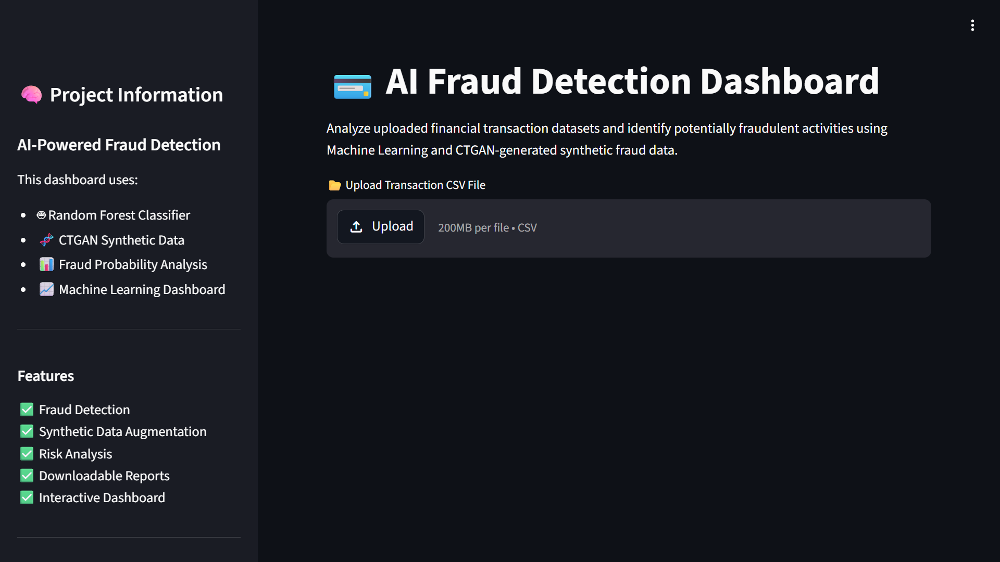
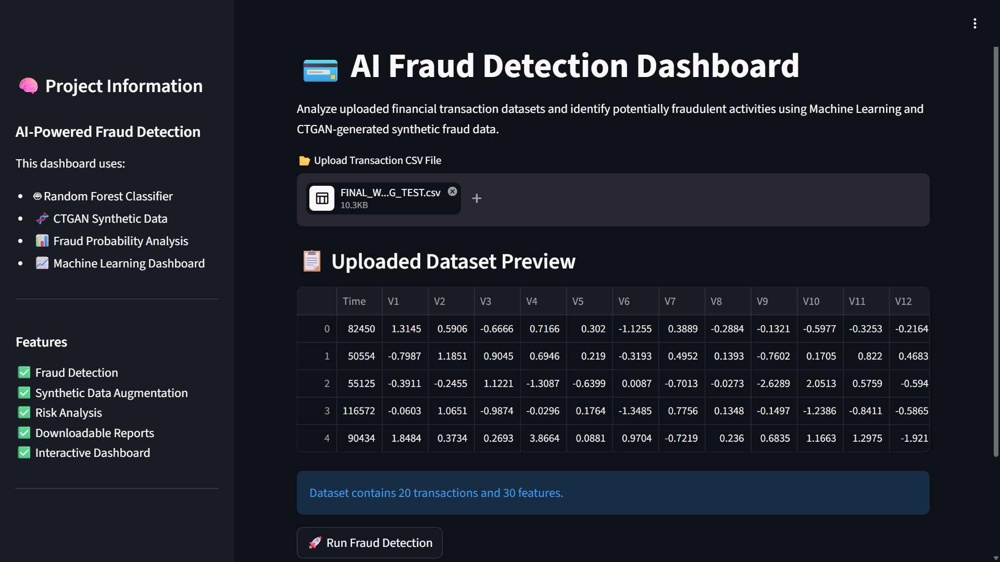
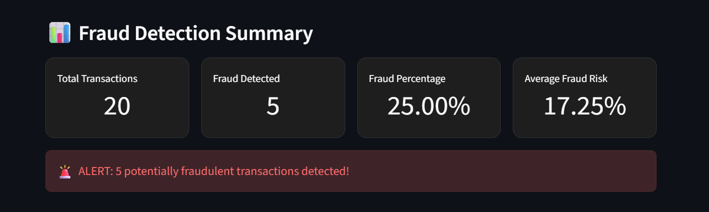
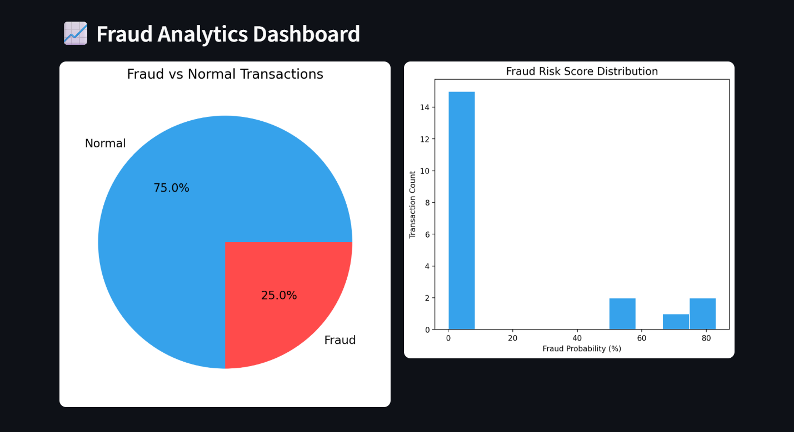
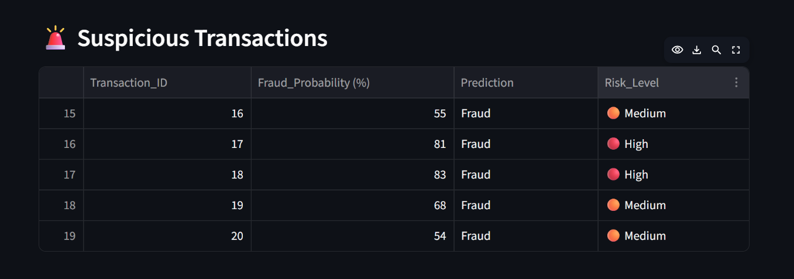
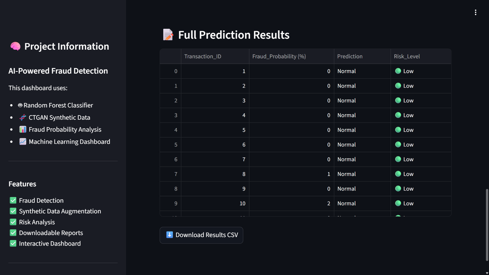

# 💳 AI Fraud Detection Using CTGAN

<p align="center">
  
</p>

<p align="center">
  <b>AI-Powered Fraud Detection System using CTGAN Synthetic Data Generation and Machine Learning</b>
</p>

---

# 📌 Project Overview

This project presents an AI-powered fraud detection system designed to identify fraudulent financial transactions using Machine Learning and CTGAN-generated synthetic data.

Fraud detection datasets are highly imbalanced because fraudulent transactions represent only a small percentage of total transactions. This imbalance often causes machine learning models to perform poorly on fraud cases.

To address this challenge, the project uses:

- **CTGAN (Conditional Tabular GAN)** for synthetic fraud data generation
- **Random Forest Classifier** for fraud prediction
- **Streamlit Dashboard** for interactive deployment and visualization

The project demonstrates how Generative AI techniques can improve fraud detection capability in real-world financial systems.

---

# 🚀 Key Features

✅ Fraud Detection using Machine Learning  
✅ CTGAN-based Synthetic Fraud Generation  
✅ Real vs Synthetic Fraud Comparison  
✅ Fraud Probability Analysis  
✅ Precision-Recall & ROC Curve Evaluation  
✅ Interactive Streamlit Dashboard  
✅ Downloadable Fraud Prediction Reports  
✅ Professional Data Visualization  

---

# 🛠️ Technology Stack

| Technology | Usage |
|---|---|
| Python | Core Development |
| Pandas | Data Processing |
| NumPy | Numerical Operations |
| Scikit-learn | Machine Learning |
| CTGAN / SDV | Synthetic Data Generation |
| Matplotlib | Data Visualization |
| Seaborn | Statistical Visualization |
| Streamlit | Interactive Dashboard |
| Joblib | Model Saving & Loading |
| Pyngrok | Public Dashboard Access |

---

# 📂 Dataset Information

This project uses the publicly available **Credit Card Fraud Detection Dataset** containing anonymized transaction features.

## Dataset Features

- `V1` to `V28` → PCA-transformed features
- `Time` → Transaction timestamp
- `Amount` → Transaction amount

## Target Variable

| Value | Meaning |
|---|---|
| 0 | Normal Transaction |
| 1 | Fraudulent Transaction |

---

## Dataset Source

Kaggle Dataset:  
https://www.kaggle.com/datasets/mlg-ulb/creditcardfraud

> Note: The original dataset is not included in this repository due to file size limitations and dataset licensing considerations.

---

# 📊 Exploratory Data Analysis (EDA)

The following analyses were performed:

- Fraud vs Normal transaction distribution
- Transaction amount distribution
- Transaction time analysis
- Correlation heatmap
- PCA visualization
- Real vs Synthetic fraud comparison

These analyses helped understand transaction behavior patterns and the impact of severe class imbalance.

---

# 🧬 Synthetic Fraud Generation using CTGAN

To improve fraud detection performance:

1. Fraud transactions were isolated from the dataset
2. CTGAN was trained on fraud samples
3. Synthetic fraud transactions were generated
4. Real and synthetic fraud data were combined
5. The augmented dataset was used for model training

This helped improve the model’s ability to identify rare fraud patterns more effectively.

---

# 🤖 Machine Learning Model

## Model Used

- Random Forest Classifier

## Training Strategy

Two separate models were evaluated:

| Model | Description |
|---|---|
| Baseline Model | Trained on original imbalanced dataset |
| Augmented Model | Trained using CTGAN-generated synthetic fraud data |

---

# 📈 Model Performance

## Baseline Model

| Metric | Score |
|---|---|
| Accuracy | 99.95% |
| AUC Score | 0.9529 |
| Fraud Recall | 74% |

---

## Augmented Model

| Metric | Score |
|---|---|
| Accuracy | 99.95% |
| AUC Score | 0.9472 |
| Fraud Recall | 80% |

---

# 🔍 Key Observation

Although both models achieved similar overall accuracy, the augmented model improved fraud recall from **74% to 80%** after synthetic data augmentation.

This demonstrates that CTGAN-generated synthetic fraud samples helped the model better learn fraud behavior patterns and improved fraud detection performance.

---

# 📸 Dashboard Features

The Streamlit dashboard allows users to:

- Upload transaction CSV datasets
- Run fraud detection instantly
- Analyze fraud probabilities
- Visualize fraud analytics
- View suspicious transactions
- Download prediction reports

---

# 📷 Dashboard Preview

## 🏠 Dashboard Home

<p align="center">
  
</p>

---

## 📂 Uploaded Dataset Preview

<p align="center">
  
</p>

---

## 📊 Fraud Detection Summary

<p align="center">
  
</p>

---

## 📈 Fraud Analytics Dashboard

<p align="center">
  
</p>

---

## 🚨 Suspicious Transactions

<p align="center">
  
</p>

---

## 📝 Prediction Results

<p align="center">
  
</p>

---

# ▶️ Run Locally

## 1️⃣ Install Dependencies

```bash
pip install -r requirements.txt
```

## 2️⃣ Run the Streamlit Application

```bash
streamlit run app.py
```

---

# 📂 Project Structure

```text
AI-Fraud-Detection-Using-CTGAN/
│
├── AI_Fraud_Detection_Using_CTGAN.ipynb
├── app.py
├── fraud_detection_model.pkl
├── scaler.pkl
├── ctgan_model.pkl
├── synthetic_fraud.csv
├── FINAL_WORKING_TEST.csv
├── requirements.txt
├── README.md
└── screenshots/
    ├── dashboard_home.png
    ├── uploaded_dataset.png
    ├── fraud_summary.png
    ├── charts.png
    ├── suspicious_transactions.png
    └── prediction_results.png
```

---

# 📌 Future Improvements

- Deep Learning-based fraud detection
- Real-time fraud monitoring systems
- Cloud deployment
- Explainable AI integration
- Banking API integration

---

# ✅ Conclusion

This project demonstrates how Generative AI and Machine Learning can be combined to improve fraud detection performance in highly imbalanced financial datasets.

By integrating:
- CTGAN synthetic data generation
- Random Forest classification
- Interactive Streamlit deployment

the system provides a scalable and practical AI-powered fraud detection solution.

---

# 👨‍💻 Author

## Chanda Sushmasri

- LinkedIn: https://www.linkedin.com/in/chanda-sushmasri/
- GitHub: https://github.com/sushmasriC
